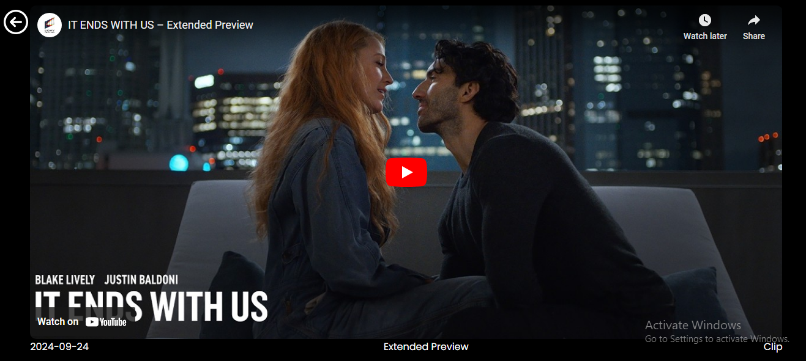

<h1 align="center"><b> Netflix-Clone </b></h1> 

Link - <a href=""> Link Available Soon</a>
 

## About Us 
 Netflix-Clone is a clone application inspired by Netflix, providing users with the ability to view, and interact with video content. Our goal is to provide a smooth and user-friendly platform for video content consumption and video information.

## Problem Statement
The Netflix-Clone application was developed to replicate and understand the fundamental functionalities of a leading video streaming platform. The primary objective of this project is to explore and implement the essential features that contribute to the popularity and user engagement of such platforms.

## Features
General Features:
-User Authentication via firebase
-Video 
-Video Playback
-Responsive design

#### Services 
-Video Recommendations
-Real-time streaming
-Subscription-based notifications for new videos

## Tech Stack

-   Frontend : Reactjs, JavaScript, HTML5, CSS3 , API's , Vite

-   Backend : Firebase , Node.js , FireDB

-   Hosting Service Provider : render

## How is our solution different

Unlike other platforms, Netflix-Clone emphasizes simplicity in user experience while offering essential functionalities. The platform has no ads, focusing purely on delivering content to users in the fastest possible way.

## Future Possible Enhancements
-Video analytics for creators
-Enhanced recommendation engine using AI
-Multi-language subtitles and closed captions

## Installation
- git clone https://github.com/yourusername/netflix-clone.git
- cd netflix-clone

## Install Dependencies

- npm install   

## Start The Development Server

- npm run dev

## Build

- npm run build

## Running unit tests

- npm test

## Running end-to-end tests

- npm run 2e2
